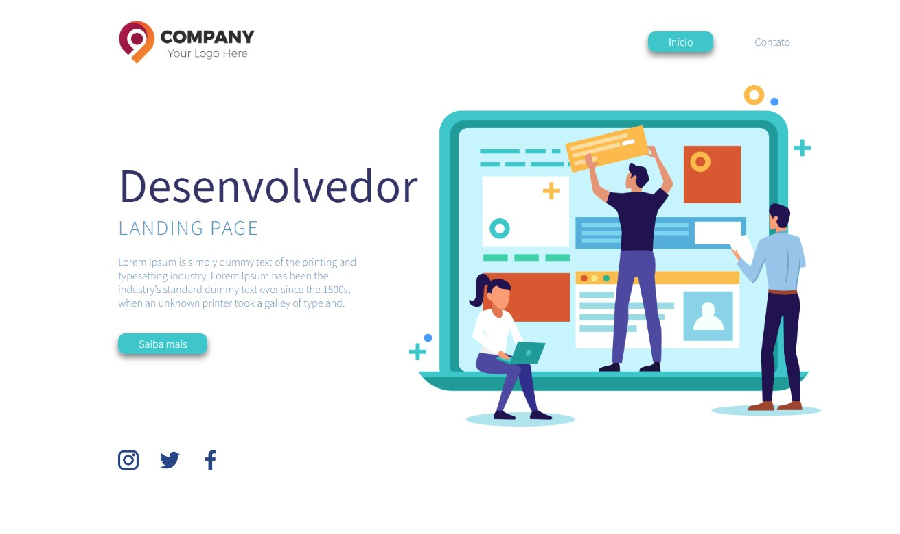
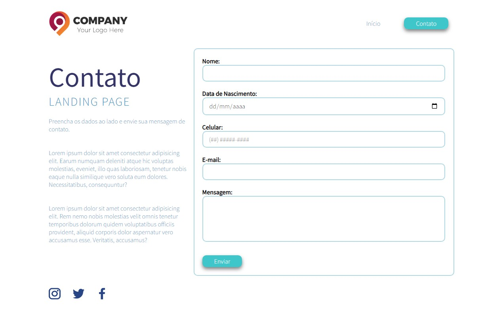

<h1 align="center"> Programação Básica em Front-End - 20h - SENAI/SC </h1>

  <a href="#-tecnologias">Tecnologias</a>&nbsp;&nbsp;&nbsp;|&nbsp;&nbsp;&nbsp;
  <a href="#-projeto">Projeto</a>&nbsp;&nbsp;&nbsp;|&nbsp;&nbsp;&nbsp;
  <a href="#-layout">Layout</a>&nbsp;&nbsp;&nbsp;|&nbsp;&nbsp;&nbsp;
  <a href="#memo-licença">Licença</a>

  

 

## 🚀 Tecnologias

Esse projeto foi desenvolvido com as seguintes tecnologias:

- HTML e CSS

Conteúdo do curso:
- Folhas de Estilo em Cascata: Posicionamento, visibilidade e transparência. Sombras, gradientes e transformações.  
Box model. Viewport e media query. Flexbox. Introdução ao CSS3. Seleção de elementos. Formas de inclusão no HTML.  
Pseudoclasses e pseudoelementos. Cores e background. Texto, fontes e web fonts.

- Linguagem de Marcação de Hypertexto: Recursos de imagem, áudio e vídeo. Estrutura do DOM. Formulários.  
Introdução ao HTML5. Definição e atributos de uma tag. Tags estruturais, textuais e semânticas. Listas. Tabelas.  

## 💻 Projeto

Uma Landing Page. (Falta fazer a responsividade)

- [Visite o projeto online](https://patyfil.github.io/front-end-senai-sc/)

## 🔖 Layout

  
   Página Inicial: 

  

  
   Página de Contato: 

   

## :memo: Licença

Esse projeto está sob a licença MIT.

---

Feito com ♥ by Patrícia
